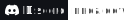

<div>
  <a href="https://nnda.itch.io"></a>
  <a href="https://www.artstation.com/nnda"></a>
  &nbsp;&nbsp;
  <a href="https://ko-fi.com/L3L536B9Z"></a>
</div>
<div align="center">
  
</div>

```gdscript
class_name Me extends CharacterBody2D

var my := {
  name     = "nnda",
  stuff    = [
   "Game Dev",
   "Web Design",
   "Digital Art",
  ]
}

func im_doing(): print(
  "I am currently doing ", my.stuff.pick_random() )

```

## Languages

&nbsp;
 &nbsp;
 &nbsp;
 &nbsp;
 &nbsp;
 &nbsp;
 &nbsp;
 &nbsp;
 &nbsp;
 &nbsp;
<br>

## Tools & Frameworks

&nbsp;
 &nbsp;
 &nbsp;
 &nbsp;
 &nbsp;
 &nbsp;
 &nbsp;
 &nbsp;
<br>

## Links & Socials

&nbsp;
<a href="https://nnda.itch.io"></a> &nbsp;
<a href="https://mastodon.art/@nnda"></a> &nbsp;
<a href="https://ko-fi.com/nnda_"></a> &nbsp;
<a href="https://www.instagram.com/nnda.afrd"></a> &nbsp;
<a href="https://www.artstation.com/nnda"></a> &nbsp;
<a href="https://codepen.io/nnda"></a> &nbsp;
<br>

</br>
</br>

<!-- https://img.shields.io/badge/Discord-nndd%230099-fff?style=flat-square&logo=discord&logoColor=white&labelColor=101217 -->

<div align="right">
  <a href="https://github.com/nndda"></a>
</div>
