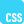
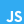

[ Offline until June 21st ]


<div align="center">
  
</div>

```gdscript
"I'm currently doing some %s." % \
    [ 'illustration', 'game dev', 'web dev' ].pick_random()
```

<div align="center">
  ≈ >ω< ≈
</div>


## Languages
&nbsp;
 &nbsp;
 &nbsp;
 &nbsp;
 &nbsp;
 &nbsp;
 &nbsp;
<br>
## Tools & Frameworks
&nbsp;
 &nbsp;
 &nbsp;
 &nbsp;
 &nbsp;
 &nbsp;
 &nbsp;
 &nbsp;
 &nbsp;
 &nbsp;
<br>

</br>
</br>

<div align="right">
  (っ◔◡◔)っ ♥
  &nbsp;
  &nbsp;
  <a target="_blank" href="https://nnda.itch.io">🕹️&nbsp;itch.io</a>
  &nbsp;
  •
  &nbsp;
  <a target="_blank" href="https://ko-fi.com/L3L536B9Z">☕&nbsp;Ko-fi</a>
  &nbsp;
  •
  &nbsp;
  <a target="_blank" href="https://www.artstation.com/nnda">🎨&nbsp;ArtStation</a>
</div>
